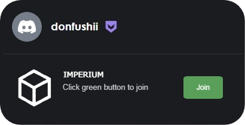

<!-- 

	~> If you see this don't forget to follow me before skid <3

-->

	

<h4 align="center">FUSHII'S | PROFILE</h4>

	.gg/sH5Mh2XfPC

  <a href="#-who-i-am">Who i am</a> •
	<a href="#-people-who-see-my-profile">Views</a> •
	<a href="#-my-projects">Projects</a>

 

## • Who i am?

**_1. Im a user like anyone else, you can call me Fushii._**
> [!]: Currently I really like using the programming language "Python" & "LUA". I have several projects in these languages that haven’t been released yet.

**_2. Would you like to contact me?_**
> [!]: You can Add me on Discord at [@donfushii](https://discord.com/users/1135775008703127672) Or simply click on the image below to reach me.

  

<!-- 

  

-->

	

  

## • People who see my profile:

**_1. Look, you're at the counter._**
> [!]: I'm grateful that you decided to check out my profile. Feel free to follow me if you'd like.

  

  

  

## • My projects:

**_1. What project are you working on?_**
> [A]: Right now, I’m working on [Imperium](https://github.com/Imperium-Development/Imperium/tree/main). A free Script for Roblox. This project has been in development for a good while and was created with good intentions and is intended for PERSONAL use only even though it’s now public. [DISCONTINUED]

**_2. Do you have any more projects?_**
> [A]: Yes, I have more projects. One of them is [Vencord Things](https://github.com/donfushii/Vencord-Things), which contains themes and plugins to customize your Discord with the external app "Vencord" This project is fully open source.
